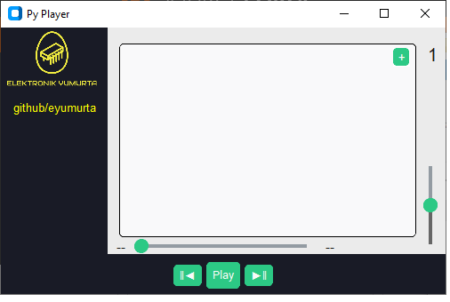
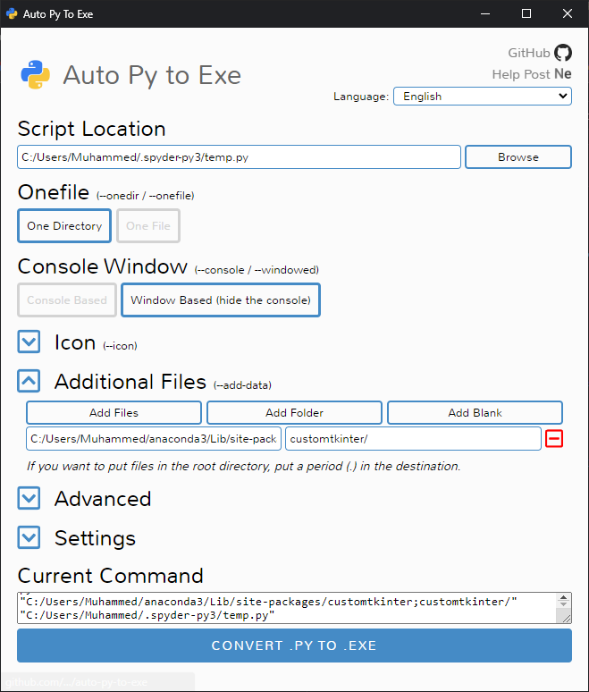

# Py Player Python Mp3 Player

 This application using pygame and customtkinter modules.This is the simplest MP3 Player.This program can be compile with Auto Py to Exe
 Auto Py to Exe Configuration

 Features:
 -Forward,Play,previos mp3 file
 -Volume slider change the volume of music
 -Adding Mp3 files with add button
 -Sound lenght,current time

 Konowing İssues:
 -While playing file add a new music file some noise in the music
 -Slider cannot set pos of music

 Auto Py to Exe Configuration:
 
 
 
